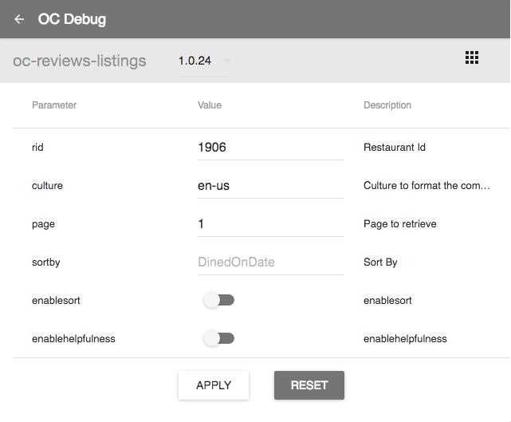

#oc-debug-extension

### PRE ALPHA

## Getting Started

1. Install WebPack `npm install webpack -g`
2. Install packages `npm install`
3. Build extension package `webpack`
4. Follow this `https://developer.chrome.com/extensions/getstarted#unpacked` to load an unpack extension from the `dist` folder of this repository

## Features
* Detect all open components on a page
* Live amending of the component's parameters 
* In place replacement of external registry with locally running copy (coming soon)

## Screenshot

### License

MIT
